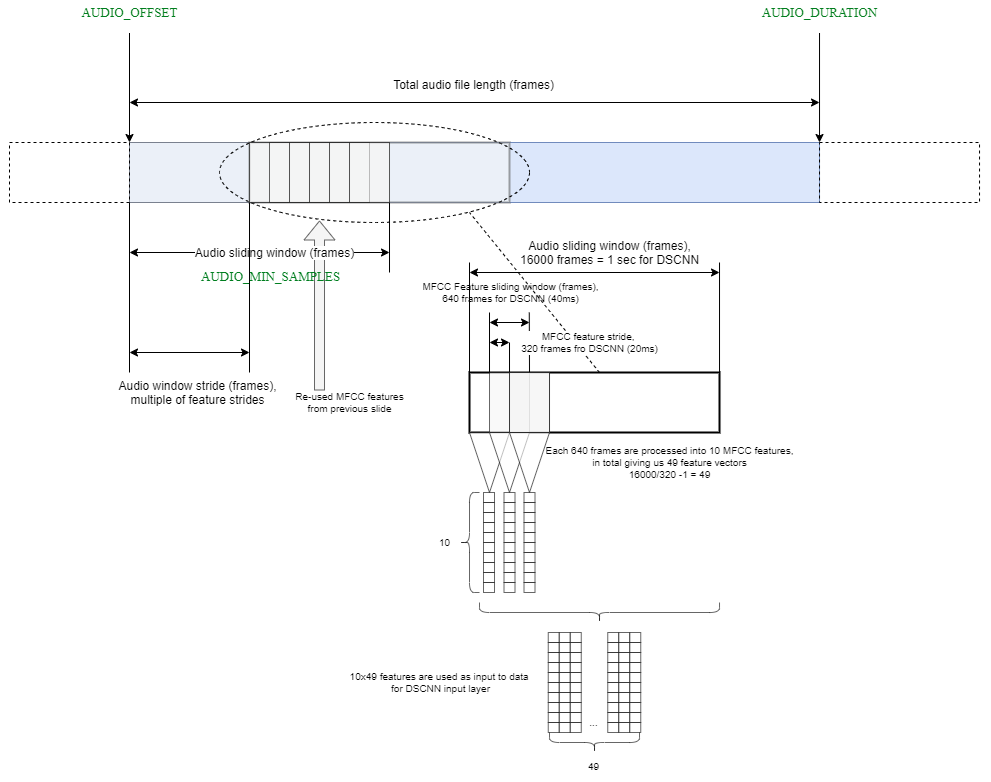
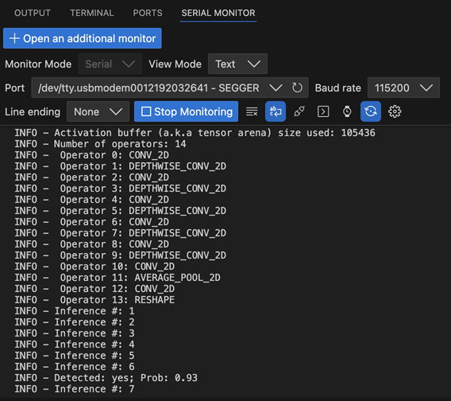

# MLEK - Audio Applications

<!-- markdownlint-disable MD013 -->
<!-- markdownlint-disable MD036 -->

This chapter describes the MLEK reference applications for real-time audio processing:

- **Keyword Spotting (KWS)**: Demonstrates wake word detection and voice command recognition
- **Audio User Algorithm Template**: Provides a foundation for custom audio ML processing applications

## Required API Interfaces

For hardware deployment, the Board-Layer should provide the following API interfaces:

| Required API Interface | Description |
|:----------------------|:------------|
| **CMSIS_VIO** | Virtual I/O interface for LEDs, buttons, and basic I/O |
| **CMSIS_VSTREAM_AUDIO_IN** | Virtual Audio Input / Audio Interface |
| **STDOUT, STDERR** | Standard output for printf debugging and logging |

These interfaces ideally are supplied by the vendor of your evaluation board. For custom hardware, details on the implementation are 
found in the [CMSIS-Driver Manual](https://arm-software.github.io/CMSIS_6/latest/Driver/group__vstream__interface__gr.html)

## Keyword Spotting Application

Keyword spotting (KWS) reference application detects predefined words or phrases from a continuous audio stream. An embedded device can listen to a list of "wake words" and use it to execute commands. This implementation uses TensorFlow Lite Micro and CMSIS-NN for optimized inference on Cortex-M processors or Ethos-U processors.

How KWS works:

- Incoming audio is captured from a microphone or played back from a test sample.
- The audio stream is preprocessed and converted into Mel-frequency cepstral coefficients (MFCC) features.
- A MicroNet keyword spotting model classifies the MFCC features to determine which keyword, if any, was spoken.
- Detection results are reported via printf messages.

### Audio Stream Preprocessing

The MicroNet keyword spotting model expects audio data to be preprocessed before performing an inference. This section is an overview of the feature extraction process used. First, the audio data is normalized to the range (-1, 1).

Mel-Frequency Cepstral Coefficients (MFCCs) are a common feature that is extracted from audio data and can
be used as input for machine learning tasks such as keyword spotting and speech recognition. For implementation
details, please refer `Mfcc.cc` and `Mfcc.hpp`. These files are part of the software component `ML Eval Kit:Common:API`.

Next, a window of 640 audio samples (40ms) is taken from the audio input. From these 640 samples, we calculate 10
MFCC features. The whole window is shifted to the right by 320 audio samples (20ms) and 10 new MFCC features are calculated. This process of shifting and calculating is repeated. For 1 second audio input, 49 windows that each have 10 MFCC features are calculated. These extracted features are quantized and an inference is performed.

### MicroMet ML Model

The KWS application uses the [MicroNet Medium INT8](https://github.com/Arm-Examples/ML-zoo/tree/master/models/keyword_spotting/micronet_medium/tflite_int8) model that is trained for twelve keywords (see file `src/Labels.cpp`).

ToDo:
  - how to get scripts?
  - how to convert models?

A sample audio file containing the word "down" is provided for testing.

The picture below shows serial output from a hardware target, while the application detects the keyword "yes" on a microphone stream.

### Build Types

The KWS example defines four build types that control debug information and the audio source:

| Build Type | Description |
|------------|-------------|
| **Debug-Live_Stream** | Uses live microphone input with debug information enabled. |
| **Release-Live_Stream** | Live microphone input with optimizations for performance. |
| **Debug-Data_Array** | Processes a built-in audio array for regression testing with debug information. |
| **Release-Data_Array** | Processes the audio array with release optimizations. |

Use the Debug build types during development and the Release build types for performance measurements. Switch between *Live_Stream* and *Data_Array* depending on whether you want real-time audio or a fixed sample. On Arm Virtual Hardware Targets, the Live_Stream is utilizing the VSI interface 

## Audio User Algorithm Template

Todo.

## Working with MLEK Templates

See Target Configuration chapters on how to deploy the reference applications to a specific hardware or simulation target. 

