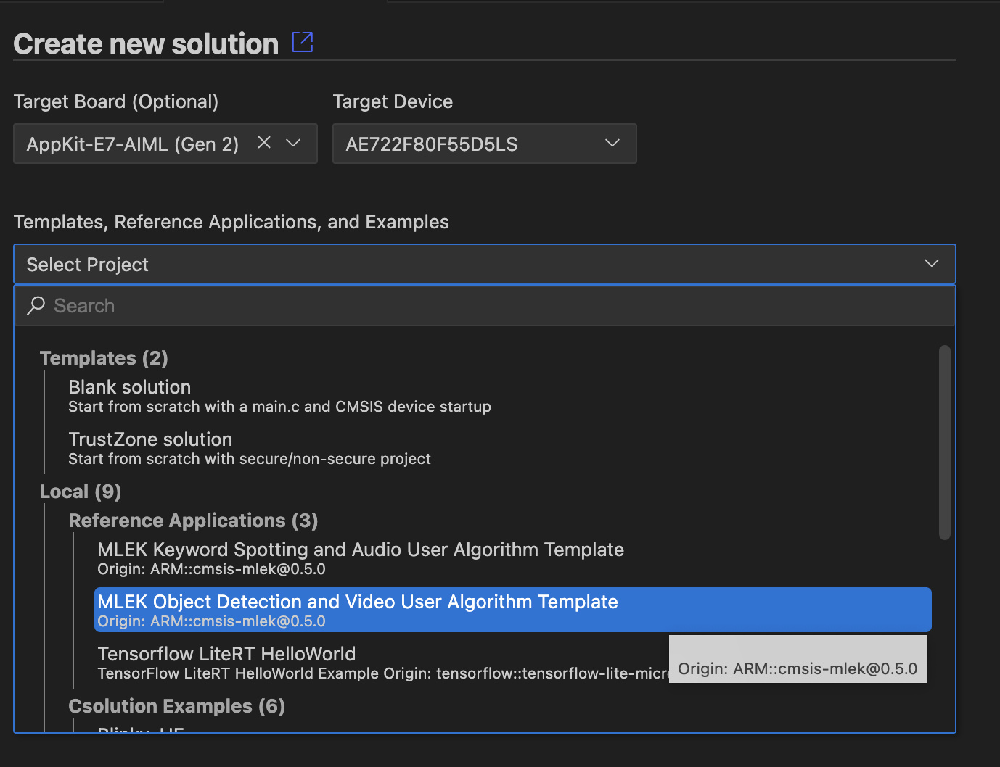

# Target Configuration Reference Application Hardware

<!-- markdownlint-disable MD013 -->
<!-- markdownlint-disable MD036 -->

### Using VS Code

This section explains how to use MLEK reference applications with the [Arm CMSIS Solution](https://marketplace.visualstudio.com/items?itemName=Arm.cmsis-csolution) extension for VS Code.

#### Install Required Packs

Install the CMSIS-MLEK pack and any required board support packs:

```shell
cpackget add ARM::cmsis-mlek
```

#### Create New Solution

1. Open VS Code and use the **Create a new solution** dialog
2. Select one of the MLEK reference applications:

   - **MLEK Keyword Spotting and Audio User Algorithm Template**

   - **MLEK Object Detection and Video User Algorithm Template** 

   - **MLEK Generic Inference Runnner**. (available in pack version 1.0+)





3. Configure the target platform and toolchain:


#### Build and Run

Refer to the [Arm CMSIS CSolution extentions documentation](https://marketplace.visualstudio.com/items?itemName=Arm.cmsis-csolution#cmsis-view) on how to use the CMSIS View. It offers convenient and pre-configured access to build and debug features. 

### Enable Ethos-U NPU support for your target

To enable NPU support for custom hardware:

1. Open the `*.csolution.yml` file and look for the first `target-type`:

```yml
target-types:
  - type: MyCustomBoard
    device: STM32U585AIIx  # Your target MCU
    variables:
    ...
```
To the "type" entry add a suffix that identifies NPU model and MAC configuration. e.g.:
```yml
  - type: MyCustomBoard-U55-128 
  # or 
  - type: MyCustomBoard-U85-512
```

This will configure the project to include the correct drivers and models for the NPU selected.

## Reference Applications

### Audio Template: Keyword Spotting

The KWS template demonstrates real-time wake word detection:

**Key Features:**

- Real-time audio preprocessing (MFCC feature extraction)
- Optimized neural network inference using CMSIS-NN
- Configurable wake word models
- Performance profiling and benchmarking

**Getting Started:**

1. Build and run the template on your target platform
2. Speak the wake word (e.g. "Yes" or "Up")
3. Observe detection results via UART output or LEDs
4. Replace the model with your custom wake word model

**Customization Points:**

- `kws/src/kws_model.cpp`: Replace with your TensorFlow Lite model
- `kws/src/audio_preprocessing.cpp`: Modify audio preprocessing pipeline  
- `kws/config/kws_config.h`: Adjust detection thresholds and parameters

### Video Template: Object Detection

The object detection template provides real-time computer vision:

**Key Features:**

- Camera input processing and frame buffering
- Object detection using MobileNet-based models
- Bounding box visualization
- Multi-object detection and classification

**Getting Started:**

1. Build and run the template with camera input
2. Point camera at objects for detection
3. View detection results on display or via debug output
4. Integrate your custom object detection model

**Customization Points:**

- `object-detection/src/detection_model.cpp`: Replace with your model
- `object-detection/src/image_preprocessing.cpp`: Modify image preprocessing
- `object-detection/config/detection_config.h`: Adjust detection parameters

### Generic Template: Inference Runner 
(available in pack version 1.0+)

The generic inference template provides maximum flexibility:

**Key Features:**

- Framework for any TensorFlow Lite model
- Configurable input/output tensors
- Performance benchmarking utilities
- Extensible architecture for custom applications

**Getting Started:**

1. Replace the example model with your TensorFlow Lite model
2. Configure input/output tensor specifications
3. Implement custom preprocessing/postprocessing
4. Build and test your custom ML application

**Customization Points:**

- `inference_runner/Model/`: Replace with your TensorFlow Lite model files
- `inference_runner/src/inference_runner.cpp`: Modify inference pipeline
- `inference_runner/config/`: Adjust model and application configuration

## Performance Optimization

All MLEK templates include built-in performance optimization features:

- **CMSIS-NN Integration**: Optimized neural network kernels for Cortex-M
- **Ethos-U Acceleration**: NPU acceleration for supported layers
- **Memory Optimization**: Efficient memory management and tensor allocation
- **Profiling Tools**: Built-in timing and resource usage measurements


## Next Steps

After successfully running an MLEK template:

1. **Model Integration**: Replace the example model with your trained TensorFlow Lite model
2. **Application Customization**: Modify the application logic for your specific use case  
3. **Performance Tuning**: Optimize for your target constraints (memory, power, latency)
4. **Hardware Deployment**: Test on your target hardware platform
5. **Production Deployment**: Integrate into your final product design

For detailed examples and additional resources, refer to the individual template README files and the MLEK documentation.


